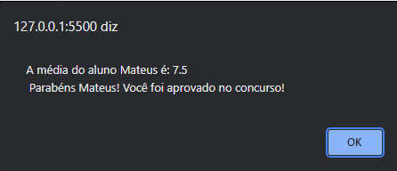

# explorer-stage04-desafio02

  

## 🖥️ Projeto
Segundo desafio proposto no stage 4, dessa vez foi desenvolvido uma aplicação que pegue uma lista de estudantes que tenha nome e duas notas, depois verificar sua média e mostrar a mensagem se ele passou ou não, incrementei mais uma informação que é referente ao gênero.
Trabalhei nesse projeto conceitos de estrutura de dados com objetos e array, estrutura de repetição, criação de funções, operadores comparativos e condicionais com o operador ternário.

## 🚀 Tecnologias
Foi desenvolvido esse projeto com as seguintes tecnologias:

- HTML
- CSS
- JAVASCRIPT
- GIT
- GITHUB
